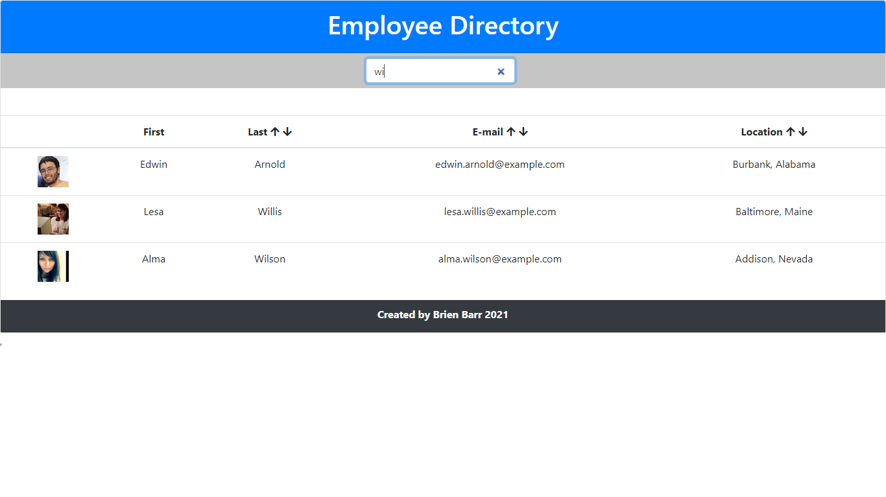

# Employee Directory

## Table of Contents

1. [Description](#Description)
2. [Languages and Technologies Used](#Languages-and-Technologies-Used)
3. [Installation](#Installation)
4. [Usage](#Usage)
5. [Screencaps](#Screencaps)
6. [Deployed App](#Deployed-App)
6. [Questions](#Questions)
<br/>
<br/>

## Description

This application allows a user to view the entire employee directory (populated with info from the [Random User API](https://randomuser.me/)) at once so that he/she has quick access to the employees' non-sensitive information.  The user is able to filter the employees by first or last name.  In addition, the user can sort the entire employee list or the filtered employee list by the employees' last name, email, or location in ascending or descending order.

<br/>
<br/>

## Languages and Technologies Used

* HTML
* CSS
* JavaScript
* Node.js
* [Random User API](https://randomuser.me/)
* React
* JSX
* Deployment on GitHub pages


<br/>
<br/>

## Installation

To run the app locally on your PC in development mode, do the following:
 
1. Clone the [repository](https://github.com/BrienBarr/employee-directory) to your PC.
2. Open the local directory to where you cloned the repository in the command line/terminal.
3. Run the npm i command from the command line/terminal.
```
npm i
```
<br/>
<br/>

## Usage

From the command-line/terminal, open the local directory to where you cloned the repository and run the "npm start" command to start the app.
```
npm start
```

Open up a web browser and go to [http://localhost:3000/employee-directory](http://localhost:3000/employee-directory).  This will take you to the client side landing page for the app.

See the deployed app in action on GitHub pages [here](https://brienbarr.github.io/employee-directory/)!

<br/>
<br/>

## Screencaps

<br/>
The landing page of the app<br/><br/>


<br/>
Filtering the employees<br/><br/>



<br/>
Sorting the filtered results by last name in descending order<br/><br/>


<br/>
Sorting the filtered results by email in ascending order<br/><br/>


<br/>
Sorting the filtered results by location in ascending order<br/><br/>


<br/>
No results found by filter<br/><br/>


<br/>
<br/>

## Deployed App

See the deployed app in action on GitHub pages [here](https://brienbarr.github.io/employee-directory/)!

<br/>
<br/>

## Questions

[GitHub/BrienBarr](https://github.com/BrienBarr)<br/>
For additional questions, e-mail me at: [brien.barr3320@gmail.com](brien.barr3320@gmail.com)